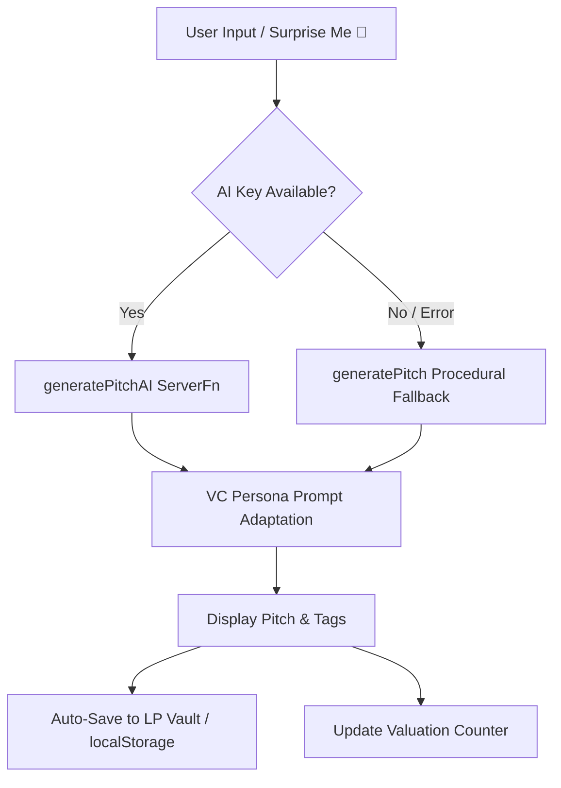

# Russ-O-Meter Architecture & Technical Design

The **Russ-O-Meter** is a high-performance, full-stack web application designed with a mobile-first philosophy to parody Silicon Valley venture capital hype and startup valuation dynamics.

---

## 1. System Overview & Tech Stack

- **Framework**: [TanStack Start](https://tanstack.com/start/latest) with [TanStack React Router](https://tanstack.com/router/latest)
- **Runtime & Bundler**: Vite 8 + Nitro Server Engine
- **Styling**: Tailwind CSS v4 + Custom Veblen-Tech Cyber Luxury Glassmorphism
- **Audio Engine**: Native Web Audio API Synthesizer (zero external audio assets)
- **AI Integration**: Vercel AI SDK with OpenAI API / Lovable AI Gateway + Procedural Satire Matrix Fallback
- **Exporting**: HTML5 Canvas Rendering Engine (PNG export & Web Share API)
- **State & Storage**: React 19 hooks + synchronous `localStorage` persistence

---

## 2. Directory Structure

```
russ-o-meter/
├── public/                     # Static assets and favicon
├── docs/                       # Project documentation
│   ├── ARCHITECTURE.md         # Technical architecture (this file)
│   ├── FEATURES.md             # Feature guide & mechanics
│   ├── AUDIO_ENGINE.md         # Web Audio synthesizer specs
│   └── CONTRIBUTING.md         # Adding personas & modifiers
├── src/
│   ├── components/             # Reusable UI & Feature Views
│   │   ├── ui/                 # Radix UI primitives & Sonner toast
│   │   ├── CelebrationOverlay  # Three Commas Club modal
│   │   ├── Confetti.tsx        # Canvas confetti physics engine
│   │   ├── Icon.tsx            # Material Symbols Outlined icons
│   │   ├── MobileBars.tsx      # Sticky Top Bar & 5-Tab Bottom Dock
│   │   ├── PersonaCarousel.tsx # Horizontal story-style VC selector
│   │   ├── PitchCard.tsx       # Generated pitch output card
│   │   ├── PitchBattle.tsx     # 2-Player pass-and-play party game
│   │   ├── ValuationLab.tsx    # Multipliers & anti-revenue penalties
│   │   ├── BurnRateSimulator.tsx # Runway & expense simulator
│   │   ├── LPDashboard.tsx     # Cap table visualizer & pitch vault
│   │   ├── TermSheetModal.tsx  # NVCA parody legal document modal
│   │   ├── SocialCardExportModal.tsx # Canvas-generated PNG social card
│   │   ├── SettingsModal.tsx   # Audio settings & data reset
│   │   └── SideNav.tsx         # Desktop responsive sidebar
│   ├── lib/
│   │   ├── audio.ts            # Web Audio API procedural sound synthesizer
│   │   ├── pitch.ts            # Procedural dictionary matrices & roasts
│   │   ├── pitch.functions.ts  # TanStack Start server functions (AI)
│   │   └── types.ts            # Shared TypeScript types & interfaces
│   ├── routes/
│   │   ├── __root.tsx          # Root shell, HTML head & metadata
│   │   └── index.tsx           # Single-page multi-tab controller
│   ├── server.ts               # Nitro server configuration
│   ├── start.ts                # TanStack Start entrypoint
│   └── styles.css              # Custom styling, neon glows, glass panels
├── package.json
└── vite.config.ts
```

---

## 3. Core Modules & Data Flow

### A. Pitch Generation Pipeline



### B. Sound Synthesis Architecture

All sound effects are synthesized client-side in real-time via `src/lib/audio.ts`:
- **Cha-Ching**: 4 parallel triangle wave oscillators modulated with exponential decay gains.
- **Rocket Launch**: Sawtooth oscillator frequency ramp (110Hz to 880Hz) filtered through a resonant lowpass filter + sub-bass sine drop.
- **Fanfare**: Arpeggiated C-major chord progression (C5 -> E5 -> G5 -> C6).
- **Buzzer**: Linearly down-swept sawtooth wave (220Hz to 110Hz).

---

## 4. Mobile Responsiveness Strategy

- **Sticky Header**: Compact 64px header displaying current valuation tier, instant audio mute/unmute toggle, and settings gear.
- **Bottom Navigation Dock**: 5 thumb-friendly touch targets with active neon rings and tactile audio feedback on tap.
- **Responsive Layout**: Desktop automatically renders a 256px frosted glass sidebar (`SideNav`) while hiding mobile bars.
